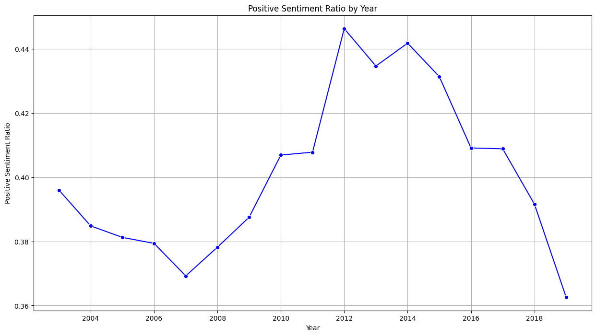
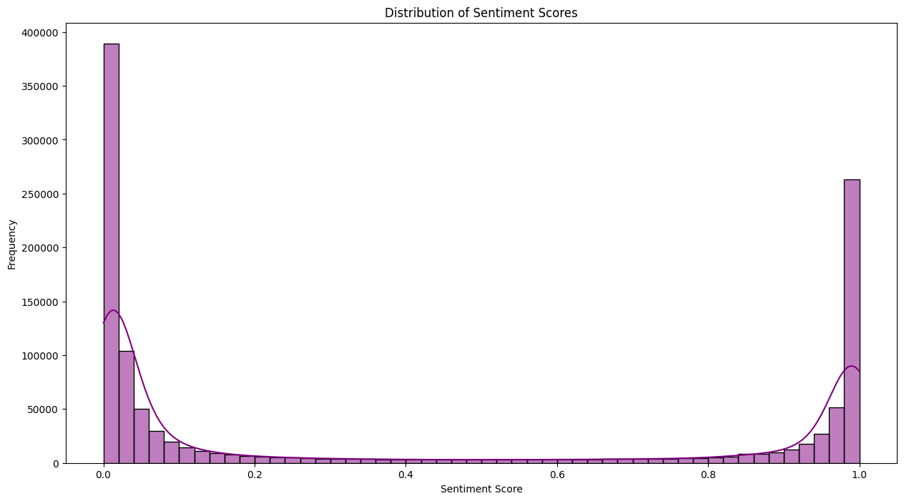
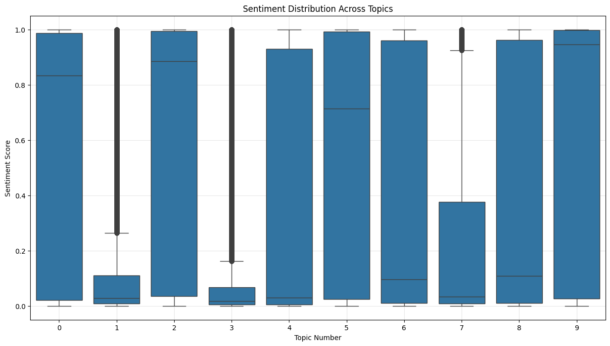
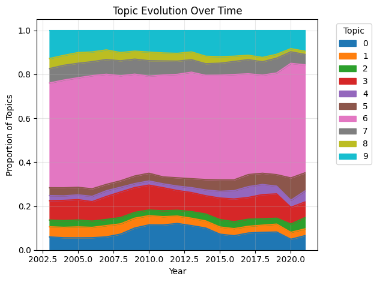
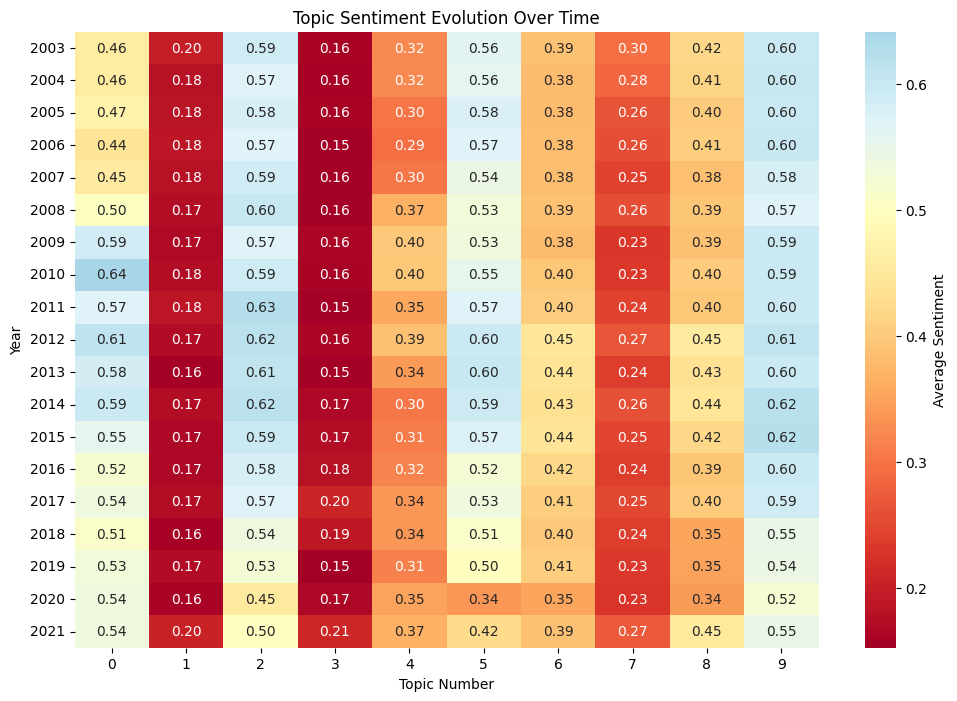

# News Headlines Sentiment Analysis

This project performs comprehensive sentiment analysis on news headlines using DistilBERT, combined with topic modeling and temporal analysis. The analysis includes sentiment trends over time, topic evolution, and the relationship between topics and sentiments.

## Analysis Components

### 1. Sentiment Distribution Over Time


The stacked bar chart shows the distribution of positive and negative headlines by year. Each bar represents the total number of headlines, with:

- Green segments showing positive headlines
- Red segments showing negative headlines
- Percentage labels indicating the proportion of each sentiment

### 2. Positive Sentiment Ratio Trends


A line plot showing the evolution of positive sentiment ratio over time, with:

- X-axis representing years
- Y-axis showing the ratio of positive sentiments
- Marked points for each year's measurement

### 3. Sentiment Score Distribution


A histogram with KDE showing the overall distribution of sentiment scores across all headlines, revealing:

- The shape of sentiment distribution
- Frequency of different sentiment scores
- Potential biases in the sentiment model

### 4. Word Clouds by Sentiment

For each year in the dataset:

- Positive headlines word cloud (white background)
- Negative headlines word cloud (black background)
  These visualizations highlight the most frequent terms in headlines of each sentiment category.

### 5. Topic Analysis

#### Topic Sentiment Distribution


A box plot showing:

- Sentiment distribution for each identified topic
- Median, quartiles, and outliers
- Comparison of sentiment patterns across topics

#### Topic Evolution


A stacked area chart displaying:

- Changes in topic proportions over time
- Relative importance of different topics
- Temporal patterns in news coverage

#### Topic-Sentiment Heatmap


A heatmap visualization showing:

- Average sentiment for each topic by year
- Temporal changes in topic sentiments
- Patterns in sentiment-topic relationships

## Technical Implementation

The analysis pipeline includes:

- Sentiment analysis using DistilBERT (fine-tuned on SST-2)
- Topic modeling using Non-negative Matrix Factorization (NMF)
- TF-IDF vectorization for text feature extraction
- Various statistical analyses including correlation studies
- Sentiment complexity analysis per topic

## Dependencies

- pandas
- matplotlib
- transformers
- torch
- wordcloud
- seaborn
- scikit-learn
- numpy

## Data

The analysis uses the ABC News headlines dataset, which includes:

- Publication dates
- Headline text
- Processed sentiment scores
- Identified topics

## Results Highlights

1. **Sentiment Trends**: The analysis reveals temporal patterns in news sentiment, showing how positive/negative ratios have evolved over time.
2. **Topic Discovery**: Identified distinct topics in the news coverage, with their associated sentiment patterns.
3. **Complexity Analysis**: Some topics show more nuanced sentiment patterns than others, as revealed by the complexity scores.

## Usage

```python
# Example code for running the analysis
import pandas as pd
from transformers import AutoTokenizer, AutoModelForSequenceClassification

# Load the data
df = pd.read_csv('abcnews-date-text.csv')

# Process dates
df['publish_date'] = pd.to_datetime(df['publish_date'], format='%Y%m%d')
df['year'] = df['publish_date'].dt.year

# Initialize sentiment model
model_name = "distilbert-base-uncased-finetuned-sst-2-english"
tokenizer = AutoTokenizer.from_pretrained(model_name)
model = AutoModelForSequenceClassification.from_pretrained(model_name)
```

## Future Improvements

1. Incorporate more sophisticated sentiment analysis models
2. Add support for real-time analysis of news headlines
3. Expand topic modeling to include hierarchical relationships
4. Develop interactive visualizations for better exploration

## Contributing

Contributions are welcome! Please feel free to submit a Pull Request.

## License

This project is licensed under the MIT License - see the LICENSE file for details.
