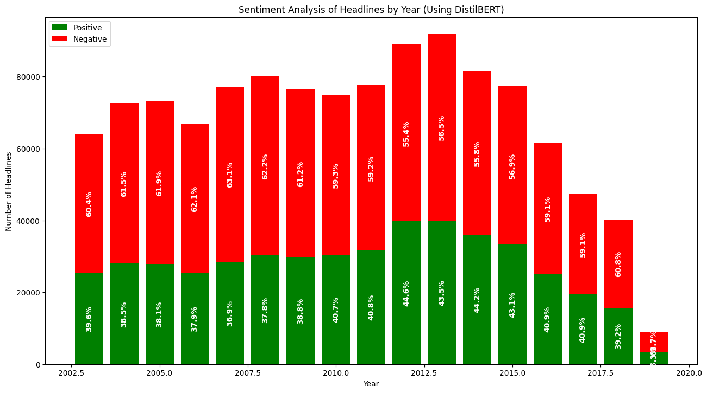
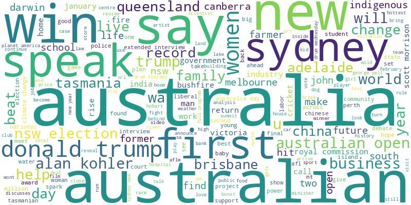
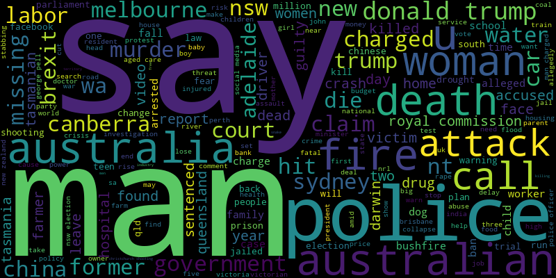

# Sentiment Analysis of ABC News Headlines

This project analyzes the sentiment of ABC News headlines over multiple years using a pre-trained DistilBERT model. Sentiments are classified as positive or negative, and results are visualized using bar charts and word clouds. The project also saves the generated visualizations as PNG files for easy sharing.

---

## Features

1. **Sentiment Classification**:

   - Headlines are classified into positive and negative sentiments using the pre-trained `distilbert-base-uncased-finetuned-sst-2-english` model.

2. **Yearly Sentiment Trends**:

   - Bar charts display the number of positive and negative headlines for each year.
   - Percentages of positive and negative sentiments are annotated on the bars.

3. **Word Clouds**:

   - Word clouds visualize the most common words in positive and negative headlines for the latest year in the dataset.
   - The word clouds are saved as PNG files for further use.

4. **Interactive Visualizations**:
   - Includes Matplotlib-generated plots to help interpret sentiment trends over time.

---

## Dependencies

This project uses the following libraries:

- `pandas` for data manipulation
- `matplotlib` for plotting
- `transformers` for using the pre-trained DistilBERT model
- `torch` for running the model on CPU/GPU
- `tqdm` for progress tracking
- `wordcloud` for generating word clouds

To install all dependencies, run:

```bash
pip install pandas matplotlib transformers torch tqdm wordcloud
```

---

## Steps to Reproduce

1. **Download the Dataset**:

   - The dataset used is `abcnews-date-text.csv`, containing ABC News headlines and their publish dates.

2. **Run the Script**:

   - Use the provided Python script to preprocess the dataset, perform sentiment analysis, and generate visualizations.

3. **Generated Outputs**:
   - **Bar Chart**:
     - A bar chart showing positive and negative sentiment counts per year.
   - **Word Clouds**:
     - Positive and negative word clouds for the most recent year, saved as:
       - `positive_wordcloud_<year>.png`
       - `negative_wordcloud_<year>.png`

---

## Example Outputs

### Bar Chart

The bar chart displays the number of positive and negative headlines for each year. Percentages are annotated on the bars:



### Word Clouds

#### Positive Headlines:



#### Negative Headlines:



---

## File Structure

```
|-- sentiment_analysis.py   # Main script for sentiment analysis
|-- abcnews-date-text.csv   # Input dataset
|-- positive_wordcloud_<year>.png   # Positive word cloud for the latest year
|-- negative_wordcloud_<year>.png   # Negative word cloud for the latest year
|-- README.md               # Project documentation
```

---

## Notes

- The script automatically detects GPU availability for faster processing using PyTorch.
- Ensure the input dataset is in the correct format (`publish_date`, `headline_text` columns).
- Adjust the `batch_size` and `max_length` in the script based on your system’s capabilities.

---

## Future Enhancements

- Extend the analysis to include neutral sentiment.
- Incorporate time-series analysis for finer granularity (e.g., monthly trends).
- Add interactivity to the visualizations using tools like Plotly or Dash.

---

## License

This project is licensed under the MIT License. Feel free to use and modify it for your own projects.

---

## Author

Developed by [Subhoraj Das]. For any questions or suggestions, please contact me at [subhorajdas084@gmail.com].
